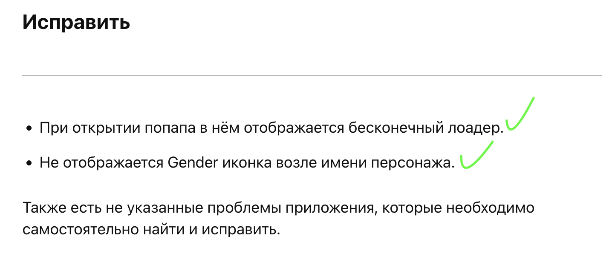
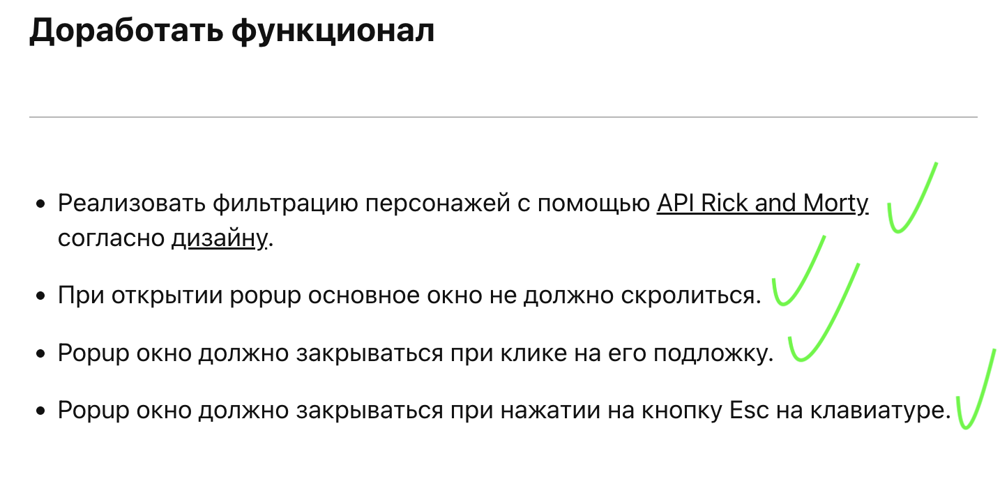
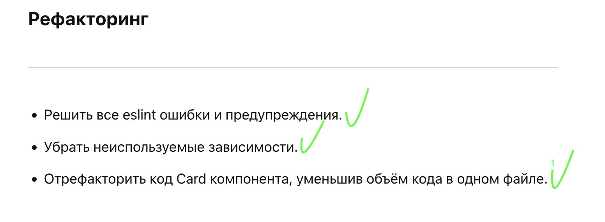
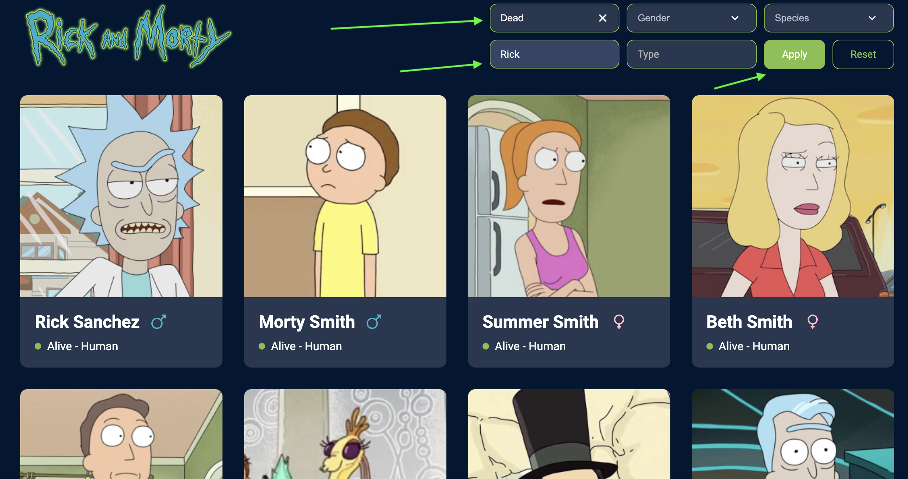
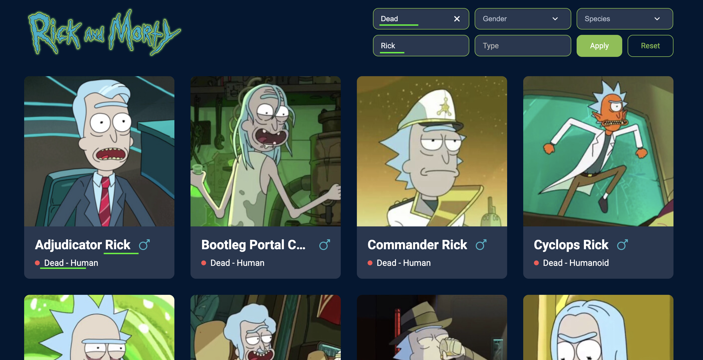

# Elfsight Test Task (Rick and Morty API)

## Установка и запуск

Требуется [Node.js](https://nodejs.org/) (рекомендуется LTS).

```bash
npm install
npm start
```

Приложение откроется в браузере (по умолчанию `http://localhost:3000`).

Проверка и автоисправление кода (ESLint + Prettier):

```bash
npm run lint
```

Деплой проекта: https://elfsight-test-task-sable.vercel.app

## По тз:

Исправить

Дополнительно: 
- В пагинации не работала кнопка Last. (Требовалось указать не .length а .length - 1)
- Указаны корретные key для отрисовки списков вместо key=index
- Сделан адаптив по макету в ТЗ
- Соблюден общий код-стайл 

Доработка функционала


Рефакторинг


## Примеры функционала: 

Главная


Фильтры по ТЗ



## О проекте

Одностраничное приложение на **React** (Create React App + `react-app-rewired`), которое загружает персонажей из публичного API [**Rick and Morty**](https://rickandmortyapi.com/). Данные запрашиваются через **axios**; состояние и фильтры — через React Context (`DataProvider`). Стили — **styled-components**.

Функциональность: сетка карточек персонажей, пагинация, фильтры/поиск с синхронизацией параметров в URL, модальное окно с деталями и эпизодами.

